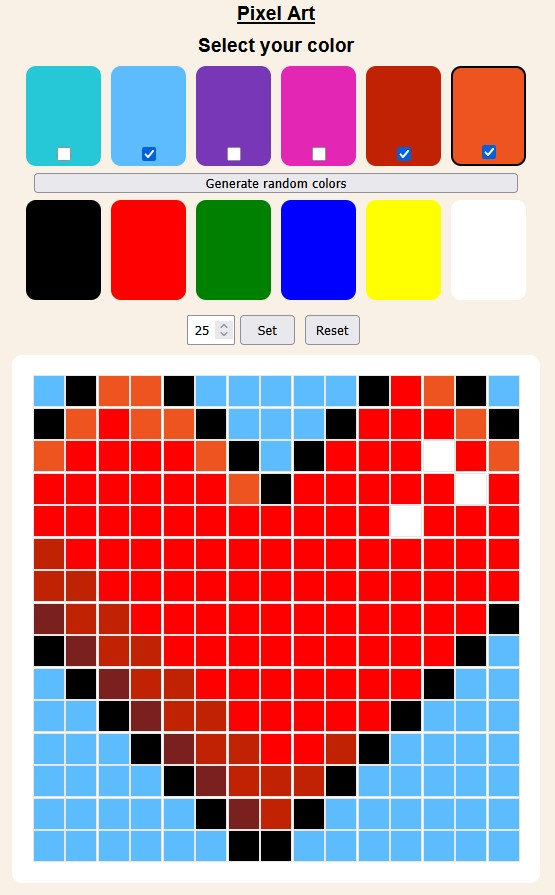

# Projeto Pixel Art

## Sobre o Projeto

O **Pixel Art** é uma **aplicação web interativa** que permite ao usuário criar desenhos pixelados em uma grade customizável. O usuário pode escolher entre cores fixas e aleatórias para colorir e **salvar** a grade atual.

O projeto foi desenvolvido com foco em fornecer uma experiência simples e divertida, ao mesmo tempo em que explora conceitos importantes de manipulação da árvore de elementos (DOM) e armazenamento local (Web Storage).

### Funcionalidades Principais:
- **Grade de Pixels**: Uma grade interativa e customizável onde o usuário pode pintar pixels, definir seu tamanho e carregar artes salvas.
- **Seleção de Cores**: Um seletor de cores para escolher a cor desejada entre cores geradas aleatoriamente e cores fixas.
- **Salvar e Recuperar Desenhos**: Utilização do **WebStorage** para salvar e carregar desenhos.

---

### Principais tópicos aplicados

#### 1. **DOM (Document Object Model)**
O DOM foi amplamente utilizado para manipular dinamicamente os elementos da página. Algumas das operações realizadas incluem:
- **Criação dinâmica de elementos**: A grade de pixels é gerada dinamicamente com base no tamanho escolhido pelo usuário.
- **Escutadores de Eventos - Event listeners**: Foram adicionados escutadores para eventos como `click` e `input` para interagir com a grade e o seletor de cores.
- **Atualização de estilos**: As cores dos pixels são alteradas dinamicamente com base na interação do usuário.

#### 2. **Web Storage**
O **Web Storage**, mais especificamente o **sessionStorage** e o **localStorage**, foram utilizados para armazenamento da seleção atual de cor do usuário e arte criada. Tratam-se de uma API do navegador que permite armazenar dados localmente (no cliente) de forma temporária.

---

## Como Executar o Projeto

1. **Clone o repositório**:
   ```bash
   git clone https://github.com/mateusgalv/JavaScript-DOM--Pixel-Art.git

2. **Abra o projeto**:
    Navegue até a pasta do projeto:
    ```bash
        cd JavaScript-DOM--Pixel-Art
    ```
    Abra o arquivo index.html no seu navegador.

3. **Comece a criar**:
    - Escolha uma cor no seletor de cores.
    - Clique nos pixels da grade para pintá-los.

4. **Funcionalidades**:
    - Novas cores serão geradas ao ser clicado "Generate random colors".
    - As cores abaixo deste botão são fixas
    - Um novo tamanho de grade será definido ao clicar em "Set"
    - A grade será limpa ao clicar em Reset
    - Seu desenho será salvo no LocalStorage ao clicar em Save.
    - Seu desenho será carregado ao clicar em Load
    - Os arquivos locais serão removidos ao selecionar "Clear Stored Data" 

---

## Estrutura do Projeto
pixel-art/
│
├── index.html          # Arquivo principal HTML  
├── styles.css          # Estilos CSS  
├── script.js           # Lógica JavaScript  
├── README.md           # Este arquivo  
└── assets/             # Pasta para imagens ou outros recursos  

## Captura de Tela

</img>

## Contatos

    GitHub: /mateusgalv
    LinkedIn: /mateus-galvao
    E-mail: mateustgalvao@gmail.com